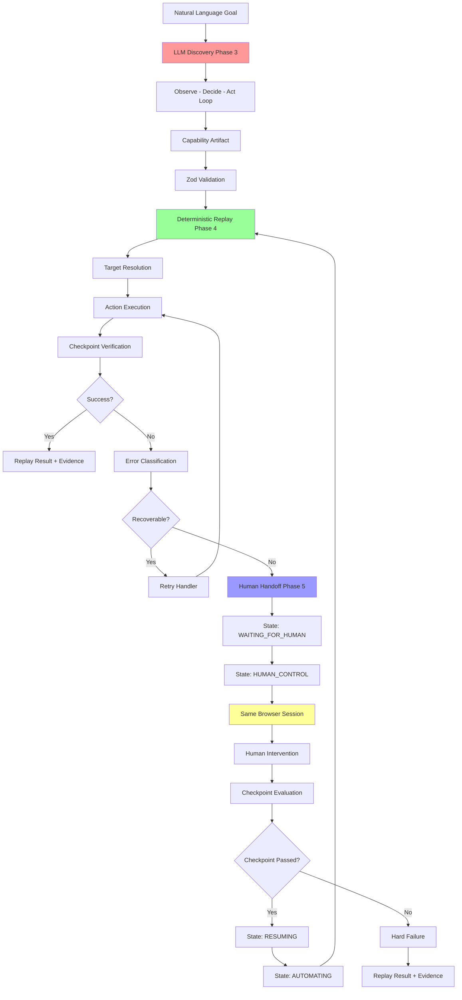

# Architecture Diagram

**LLM Boundary:**
- LLM is used ONLY in Phase 3 Discovery (highlighted in red)
- Phase 4 Replay (highlighted in green) is completely independent of LLM
- Phase 5 Handoff (highlighted in blue) is completely independent of LLM
- Same Browser Session (highlighted in yellow) preserves continuity across handoff
